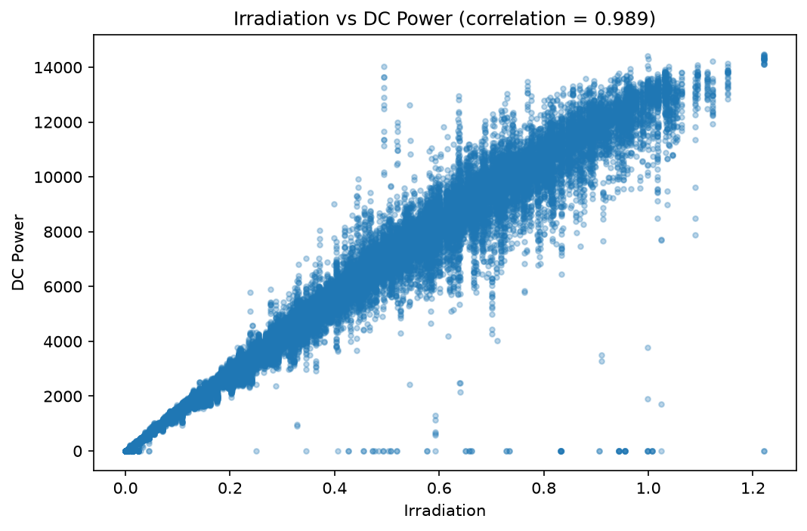
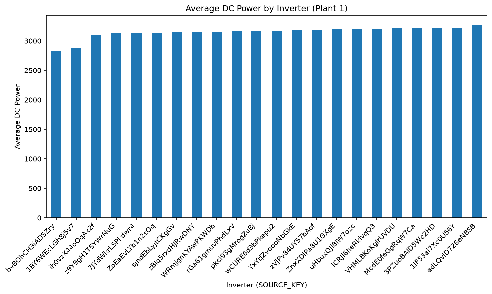

# Solar Generation Analysis

A data quality investigation into a solar power generation dataset — tracing an anomalous 12x output gap between two power plants back to its root cause using SQL-style joins and correlation analysis in pandas.

## Problem

Raw sensor readings from two solar plants (Plant 1 and Plant 2) showed Plant 2 generating roughly 12x more power than Plant 1 under similar conditions. Taken at face value, this would look like a massive performance difference between plants — but before reporting a number like that, it needed to be verified against the underlying data rather than trusted as-is.

## Dataset

Solar Power Generation Dataset (Kaggle) — two plants, each with:
- **Generation data**: DC power, AC power, daily yield (15-minute intervals, per inverter)
- **Weather sensor data**: ambient temperature, module temperature, irradiation (15-minute intervals)

68,774 rows after joining generation and weather data on `DATE_TIME` and `PLANT_ID`.

## Investigation steps

1. **Load and join** — Loaded both plants' generation and weather CSVs into pandas, joined generation data with weather data on timestamp and plant ID.
2. **Hit a blocker** — The initial join returned 0 matching rows. Traced this to a **date format mismatch**: Plant 1's timestamps were stored as `DD-MM-YYYY HH:MM`, while Plant 2's were `YYYY-MM-DD HH:MM:SS`. Fixed by parsing both to a common `datetime` format with explicit `pd.to_datetime(..., format=...)` before joining.
3. **Re-ran the comparison** — Once joined correctly, re-checked the output gap between plants.
4. **Root cause analysis** — Grouped by plant and inverter, compared DC power output against irradiation (the input the output should scale with). Found that Plant 1's readings tracked expected irradiation-to-power ratios once time was aligned correctly — the original 12x gap was a symptom of the broken join, not a real performance difference.
5. **Correlation check** — Confirmed `IRRADIATION` and `DC_POWER` correlate at **0.989**, validating that the corrected dataset behaves physically as expected.
6. **Inverter-level analysis** — Grouped by `SOURCE_KEY` (inverter ID) to identify the lowest-performing inverter by average DC power output relative to irradiation, flagging it as a candidate for maintenance inspection.
7. **Time-of-day pattern** — Aggregated output by hour to confirm generation follows the expected solar curve (near-zero at night, peak around midday).

## Key finding

The 12x output gap was a **data quality issue** — a broken join caused by inconsistent timestamp formats between the two plants' export files — not an actual performance or hardware problem. This is the kind of check that needs to happen before a number like "12x difference" ever reaches a report or a stakeholder.

## Visualizations

**Irradiation vs. DC Power** — confirms the 0.989 correlation visually; points track a clear linear trend, with a small cluster of outliers (high irradiation, near-zero power) worth investigating separately.

**Average DC Power by Inverter (Plant 1)** — ranks all inverters by average output, making the lowest performer (`bvBOhCH3iADSZfy`) visually obvious as a maintenance candidate.

## Tech stack

Python · pandas · matplotlib · SQL-style joins (`merge`, `groupby`) · correlation analysis

## Files

- `solar_analysis.ipynb` — main analysis notebook
- `irradiation_vs_dcpower.png`, `inverter_comparison.png` — output charts
- Dataset CSVs (Plant 1 & 2 generation + weather data)
